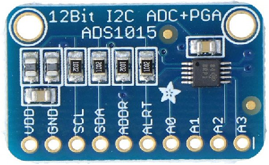

🏠 [Main Page](../README.md) <br>
>##  ***dev_ads1015*** - ADS1015 Four Channel 12-bit ADC
💾File: **dev_ads1015.h** <br>
📦Library: **dev_ads1x15** <br>
######  <br>
## **Description:** <br>
The ADS1015 is a 12-bit analog to digital converter with four inputs. <br>
The conversion time is 1ms/channel. <br>
A0 .. A3 are analog inputs. <br>
Depends on configuration, input is Single-End to GND oder Differential. <br>
Single-End to GND inputs allows always positive input voltage. <br>
More than 3.3V on input can damage the adc input (on VDD 3.3V). <br>
Default input range is +2.048V and Single-End to GND. <br>
For measure up to 3.3V set input range to +4.096V. <br>
If the input range is more than +2.048V, the chip interpolate the value. <br>
For more input voltage than 3.3V use voltage divider resistor. <br>
I2C address is selectable with ADDR pin. <br>
######  <br>
### ADS1015 ADC Module <br>
 <br>
######  <br>
## **Constants:** <br>
--- 
ADS1015 Address: <br>
🔢Enum:  ***ADS1015_ADDR0*** Address 0 (0x48) ADDR - GND or open <br>
🔢Enum:  ***ADS1015_ADDR1*** Address 1 (0x49) ADDR - VDD <br>
🔢Enum:  ***ADS1015_ADDR2*** Address 2 (0x4A) ADDR - SDA <br>
🔢Enum:  ***ADS1015_ADDR3*** Address 3 (0x4B) ADDR - SCL <br>
######  <br>
ADS1015 Channel: <br>
🔢Enum:  ***ADS1015_CH0*** Channel 0 <br>
🔢Enum:  ***ADS1015_CH1*** Channel 1 <br>
🔢Enum:  ***ADS1015_CH2*** Channel 2 <br>
🔢Enum:  ***ADS1015_CH3*** Channel 3 <br>
######  <br>
ADS1015 Input Range: <br>
🔢Enum:  ***ADS1015_GAIN_6114*** Max. input voltage 6.114V (interpolated) <br>
🔢Enum:  ***ADS1015_GAIN_4096*** Max. input voltage 4.096V (interpolated) <br>
🔢Enum:  ***ADS1015_GAIN_2048*** Max. input voltage 2.048V (default) <br>
🔢Enum:  ***ADS1015_GAIN_1024*** Max. input voltage 1.024V <br>
🔢Enum:  ***ADS1015_GAIN_0512*** Max. input voltage 0.512V <br>
🔢Enum:  ***ADS1015_GAIN_0256*** Max. input voltage 0.256V <br>
######  <br>
ADS1015 Input-0 Settings: <br>
🔢Enum:  ***ADS1015_AI0_AI1*** Differential input <br>
🔢Enum:  ***ADS1015_AI3_AI0*** Differential input <br>
🔢Enum:  ***ADS1015_AI1_AI3*** Differential input <br>
🔢Enum:  ***ADS1015_AI2_AI3*** Differential input <br>
🔢Enum:  ***ADS1015_AI0_GND*** Single end Input <br>
🔢Enum:  ***ADS1015_AI1_GND*** Single end Input <br>
🔢Enum:  ***ADS1015_AI2_GND*** Single end Input <br>
🔢Enum:  ***ADS1015_AI3_GND*** Single end Input <br>
######  <br>
## **Functions:** <br>
--- 
#### 💠Function:  ***dev_ads1015_read_ex*** - Read extended ads1015 channel
```c 
bool dev_ads1015_read_ex(i2c_inst_t* i2c, uint8_t addr, uint8_t channel, uint8_t mux, uint8_t gain, double *value)
```
- ▶️Param:  ***i2c*** I2C channel i2c0 or i2c1 <br>
- ▶️Param:  ***addr*** I2C address ADS1015_ADDRn <br>
- ▶️Param:  ***channel*** Channel number ADS1015_CHn <br>
- ▶️Param:  ***mux*** Input mode ADS1015_AIx_xx <br>
- ▶️Param:  ***gain*** Input range ADS1015_GAIN_xxxx <br>
- ▶️Param:  ***value*** Channel adc value <br>
- ✅Return: true <br>
- ❌Error Return: false <br>

#### 💠Function:  ***dev_ads1015_read*** - Read ads1015 channel with single-end
```c 
static inline bool dev_ads1015_read(i2c_inst_t* i2c, uint8_t addr, uint8_t channel, uint8_t gain, double *value)
```
- ▶️Param:  ***i2c*** I2C channel i2c0 or i2c1 <br>
- ▶️Param:  ***addr*** I2C address ADS1015_ADDRn <br>
- ▶️Param:  ***channel*** Channel number ADS1015_CHn <br>
- ▶️Param:  ***gain*** Input range ADS1015_GAIN_xxxx <br>
- ▶️Param:  ***value*** Channel adc value <br>
- ✅Return: true <br>
- ❌Error Return: false <br>

