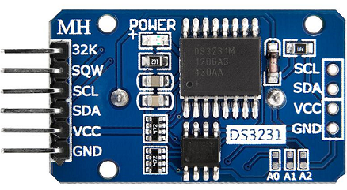

🏠 [Main Page](../README.md) <br>
>##  ***dev_ds3231*** - DS3231 extremely accurate RTC
💾File: **dev_ds3231.h** <br>
📦Library: **dev_ds3231** <br>
######  <br>
## **Description:** <br>
The DS3231 is a extremely accurate real-time clock. <br>
I2C interface with up to 400kHz. <br>
Battery-Backup input for continuous timekeeping. <br>
### DS3231 extremely accurate RTC <br>
 <br>
######  <br>
## **Functions:** <br>
--- 
#### 💠Function:  ***dev_ds3231_setdatetime*** - Set DS3231
```c 
bool dev_ds3231_setdatetime(i2c_inst_t* i2c, datetime_t *dt)
```
- ▶️Param:  ***i2c*** I2C channel i2c0 or i2c1 <br>
- ▶️Param:  ***dt*** datetime_t with data to set <br>
- ✅Return: true if set <br>
- ❌Error Return: false comm. error <br>

#### 💠Function:  ***dev_ds3231_getdatetime*** - Get DS3231
```c 
bool dev_ds3231_getdatetime(i2c_inst_t* i2c, datetime_t *dt)
```
- ▶️Param:  ***i2c*** I2C channel i2c0 or i2c1 <br>
- ▶️Param:  ***dt*** datetime_t struct where get data <br>
- ✅Return: true if get <br>
- ❌Error Return: false comm. error <br>

#### 💠Function:  ***dev_ds3231_setrtc*** - Set Pico RTC from date-time of DS3231
```c 
bool dev_ds3231_setrtc(i2c_inst_t* i2c)
```
- ▶️Param:  ***i2c*** I2C channel i2c0 or i2c1 <br>
- ✅Return: true if set <br>
- ❌Error Return: false comm. error <br>

