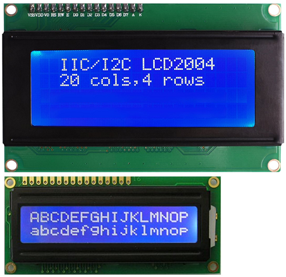

🏠 [Main Page](../README.md) <br>
>##  ***dev_hd44780*** - HD44780 LCD Driver with PCF8574
💾File: **dev_hd44780.h** <br>
📦Library: **dev_hd44780** <br>
######  <br>
## **Description:** <br>
The Hitachi HD44780 LCD controller drives alphanumeric LCD displays <br>
with 2x16 (1602) or 4x20 (2004) LCD displays. <br>
This driver supports HD44780 with I2C on PCF8574 port expander. <br>
Use level shifter to interface with Raspberry Pico. <br>
LCD needs 5V for valid operation or use 3.3V LCD displays. <br>
### 2004 and 1602 LCD Display <br>
 <br>
######  <br>
## **Functions:** <br>
--- 
#### 💠Function:  ***dev_hd44780_init*** - Init hd44780
```c 
void dev_hd44780_init(i2c_inst_t* i2c, uint8_t addr)
```
- ▶️Param:  ***i2c*** I2c channel i2c0 or i2c1 <br>
- ▶️Param:  ***addr*** I2c address (0x27..) <br>

#### 💠Function:  ***dev_hd44780_text*** Write text to hd44780 lcd
```c 
void dev_hd44780_text(i2c_inst_t* i2c, uint8_t addr, uint8_t line, bool is4line, uint8_t* txt)
```
- ▶️Param:  ***i2c*** I2c channel i2c0 or i2c1 <br>
- ▶️Param:  ***addr*** I2c address (0x27..) <br>
- ▶️Param:  ***line*** Line number 0..3 (4 line lcd), 0..1 (2 line lcd) <br>
- ▶️Param:  ***is4line*** True for 4 line lcd type <br>
- ▶️Param:  ***txt*** Text in format col;text, without col format, text is written to column 0 <br>

#### 💠Function:  ***dev_hd44780_bargraph*** Display bargraph on hd44780 lcd
```c 
void dev_hd44780_bargraph(i2c_inst_t* i2c, uint8_t addr, uint8_t line, bool is4line, uint8_t data)
```
- ▶️Param:  ***i2c*** I2c channel i2c0 or i2c1 <br>
- ▶️Param:  ***addr*** I2c address (0x27..) <br>
- ▶️Param:  ***line*** Line number 0..3 (4 line lcd), 0..1 (2 line lcd) <br>
- ▶️Param:  ***is4line*** True for 4 line lcd type <br>
- ▶️Param:  ***data*** In range 0..100 <br>

