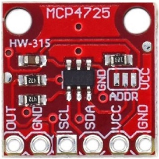

🏠 [Main Page](../README.md) <br>
>##  ***dev_mcp4725*** - MCP4725 One Channel 12-bit ADC
💾File: **dev_mcp4725.h** <br>
📦Library: **dev_mcp472x** <br>
######  <br>
## **Description:** <br>
The MCP4725 is a 12-bit digital to analog converter with one output. <br>
The chip can connected direct to Pico with supply voltage 3.3V. <br>
Maximum output voltage is VDD (3.3V). <br>
######  <br>
### MCP4725 DAC Module <br>
 <br>
######  <br>
MCP4725 IC2 address: <br>
🔢Enum:  ***MCP4725_ADDR0*** I2C address (0x61) A0 to GND or open <br>
🔢Enum:  ***MCP4725_ADDR1*** I2C address (0x62) A0 to VDD <br>
######  <br>
MCP4725 Power Down: <br>
🔢Enum:  ***MCP4725_PD_OFF*** Power down off <br>
🔢Enum:  ***MCP4725_PD_1*** Power down with 1k resistor <br>
🔢Enum:  ***MCP4725_PD_100*** Power down with 100k resistor <br>
🔢Enum:  ***MCP4725_PD_500*** Power down with 500k resistor <br>
######  <br>
## **Functions:** <br>
--- 
#### 💠Function:  ***dev_mcp4725_pd*** - Sets power down for channel (active on set or save to dac)
#### Default power down is MCP4725_PD_OFF
```c 
void dev_mcp4725_pd(uint8_t pd)
```
- ▶️Param:  ***pd*** Power down settings MCP4725_PD_xxx <br>

#### 💠Function:  ***dev_mcp4725_set*** - Sets adc output
```c 
bool dev_mcp4725_set(i2c_inst_t* i2c, uint8_t addr, uint16_t value)
```
- ▶️Param:  ***i2c*** I2C channel i2c0 or i2c1 <br>
- ▶️Param:  ***addr*** I2C address MCP4725_ADDRn <br>
- ▶️Param:  ***value*** Output value for for channnel (0..4095) <br>
- ✅Return: true <br>
- ❌Error Return: false <br>

#### 💠Function:  ***dev_mcp4725_save*** - Sets adc output and save settings to EEPROM (50ms)
```c 
bool dev_mcp4725_save(i2c_inst_t* i2c, uint8_t addr, uint16_t value)
```
- ▶️Param:  ***i2c*** I2C channel i2c0 or i2c1 <br>
- ▶️Param:  ***addr*** I2C address MCP4725_ADDRn <br>
- ▶️Param:  ***value*** Output value for for channnel (0..4095) <br>
- ✅Return: true <br>
- ❌Error Return: false <br>

