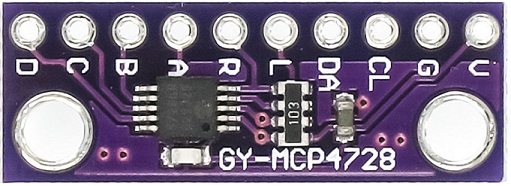

🏠 [Main Page](../README.md) <br>
>##  ***dev_mcp4728*** - MCP4728 Four Channel 12-bit DAC
💾File: **dev_mcp4728.h** <br>
📦Library: **dev_mcp472x** <br>
######  <br>
## **Description:** <br>
The MCP4728 is a 12-bit digital to analog converter with four outputs. <br>
The chip can connected direct to Pico with supply voltage 3.3V. <br>
Maximum output voltage is 3.3V. <br>
######  <br>
### MCP4728 DAC Module <br>
 <br>
######  <br>
MCP4728 Channel: <br>
🔢Enum:  ***MCP4728_CHA*** Channel A <br>
🔢Enum:  ***MCP4728_CHA*** Channel B <br>
🔢Enum:  ***MCP4728_CHA*** Channel C <br>
🔢Enum:  ***MCP4728_CHA*** Channel D <br>
######  <br>
MCP4728 Gain: <br>
🔢Enum:  ***MCP4728_GAIN1*** Gain x 1 <br>
🔢Enum:  ***MCP4728_GAIN2*** Gain x 2 <br>
######  <br>
MCP4728 VRef: <br>
🔢Enum:  ***MCP4728_VREF_VDD*** VRef VDD <br>
🔢Enum:  ***MCP4728_VREF_INT*** VRef Internal <br>
######  <br>
MCP4728 Power Down: <br>
🔢Enum:  ***MCP4728_PD_OFF*** Power down off <br>
🔢Enum:  ***MCP4728_PD_1*** Power down with 1k resistor <br>
🔢Enum:  ***MCP4728_PD_100*** Power down with 100k resistor <br>
🔢Enum:  ***MCP4728_PD_500*** Power down with 500k resistor <br>
######  <br>
## **Functions:** <br>
--- 
#### 💠Function:  ***dev_mcp4728_pd*** - Sets power down for channel (active on set or save to dac)
#### Default power down is MCP4728_PD_OFF
```c 
void dev_mcp4728_pd(uint8_t ch, uint8_t pd)
```
- ▶️Param:  ***ch*** DAC channel MCP4728_CHAx <br>
- ▶️Param:  ***pd*** Power down settings MCP4728_PD_xxx <br>

#### 💠Function:  ***dev_mcp4728_vref*** - Sets Vref for channel (active on set or save to dac)
#### Default Vref is MCP4728_VREF_INT
```c 
void dev_mcp4728_vref(uint8_t ch, uint8_t vref)
```
- ▶️Param:  ***ch*** DAC channel MCP4728_CHAx <br>
- ▶️Param:  ***vref*** Vref settings MCP4728_VREF_XX <br>

#### 💠Function:  ***dev_mcp4728_gain*** - Sets gain for channel (active on set or save to dac)
#### Default gain is MCP4728_GAIN2
```c 
void dev_mcp4728_gain(uint8_t ch, uint8_t gain)
```
- ▶️Param:  ***ch*** DAC channel MCP4728_CHAx <br>
- ▶️Param:  ***vref*** Gain settings MCP4728_GAINn <br>

#### 💠Function:  ***dev_mcp4728_set*** - Sets adc output
```c 
bool dev_mcp4728_set(i2c_inst_t* i2c, uint8_t ch, uint16_t value)
```
- ▶️Param:  ***i2c*** I2C channel i2c0 or i2c1 <br>
- ▶️Param:  ***ch*** DAC channel MCP4728_CHAx <br>
- ▶️Param:  ***value*** Output value for for channnel (0..4095) <br>
- ✅Return: true <br>
- ❌Error Return: false <br>

#### 💠Function:  ***dev_mcp4728_save*** - Sets adc output and save settings to EEPROM (50ms)
```c 
bool dev_mcp4728_save(i2c_inst_t* i2c, uint8_t ch, uint16_t value)
```
- ▶️Param:  ***i2c*** I2C channel i2c0 or i2c1 <br>
- ▶️Param:  ***ch*** DAC channel MCP4728_CHAx <br>
- ▶️Param:  ***value*** Output value for for channnel (0..4095) <br>
- ✅Return: true <br>
- ❌Error Return: false <br>

