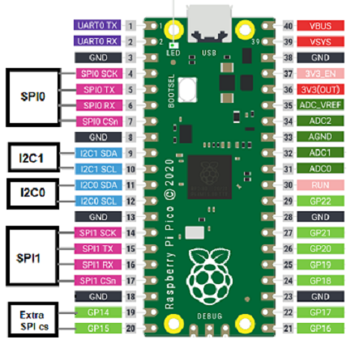

🏠 [Main Page](../README.md) <br>
>##  ***sys_adc*** - Analog to Digital Converter Functions
💾File: **sys_adc.h** <br>
📦Library: **lib2_sys** <br>
######  <br>
### Default pin assignment for lib2 <br>
 <br>
## **Constants:** <br>
--- 
### **ADC channel** <br>
🔟Const:  ***ADC_CH_0*** ADC0 <br>
🔟Const:  ***ADC_CH_1*** ADC1 <br>
🔟Const:  ***ADC_CH_2*** ADC2 <br>
🔟Const:  ***ADC_CH_V*** VSYS Voltage <br>
🔟Const:  ***ADC_CH_T*** Internal Temp. Sensor <br>
######  <br>
### **ADC Reference Voltage** <br>
🔟Const:  ***ADC_VREF*** ADC Reference Voltage (3.3V) <br>
######  <br>
## **Functions:** <br>
--- 
#### 💠Function:  ***sys_adc_init*** - Init ADC channel
```c 
void sys_adc_init(uint8_t ch)
```
- ▶️Param:  ***ch*** ADC channel <br>

#### 💠Function:  ***sys_adc_raw*** - Read ADC raw value
```c 
uint16_t sys_adc_raw(uint8_t ch)
```
- ▶️Param:  ***ch*** ADC channel <br>
- ✅Return: ADC raw value 0..4095 (0..VREF) <br>

#### 💠Function:  ***sys_adc_scale*** - Read ADC and scale raw value to low..high
```c 
static inline double sys_adc_scale(uint8_t ch, double low, double high)
```
- ▶️Param:  ***ch*** ADC channel <br>
- ▶️Param:  ***low*** Low value for 0 <br>
- ▶️Param:  ***high*** High value for 4095 (3.3V or VREF) <br>
- ✅Return: Value between low and high <br>

#### 💠Function:  ***sys_adc_volt*** - Read ADC voltage value
```c 
static inline double sys_adc_volt(uint8_t ch)
```
- ▶️Param:  ***ch*** ADC channel <br>
- ✅Return: ADC voltage value 0..3.3V (VREF) <br>

#### 💠Function:  ***sys_adc_vsys*** - Read ADC VSYS voltage
```c 
static inline double sys_adc_vsys()
```
- ✅Return: VSYS voltage value ~5V <br>

#### 💠Function:  ***sys_adc_temp_c*** - Read ADC internal temp. sensor in celsius
```c 
static inline double sys_adc_temp_c()
```
- ✅Return: Temp. value in celsius <br>

#### 💠Function:  ***sys_adc_temp_f*** - Read ADC internal temp. sensor in fahrenheit
```c 
static inline double sys_adc_temp_f()
```
- ✅Return: Temp. value in fahrenheit <br>

